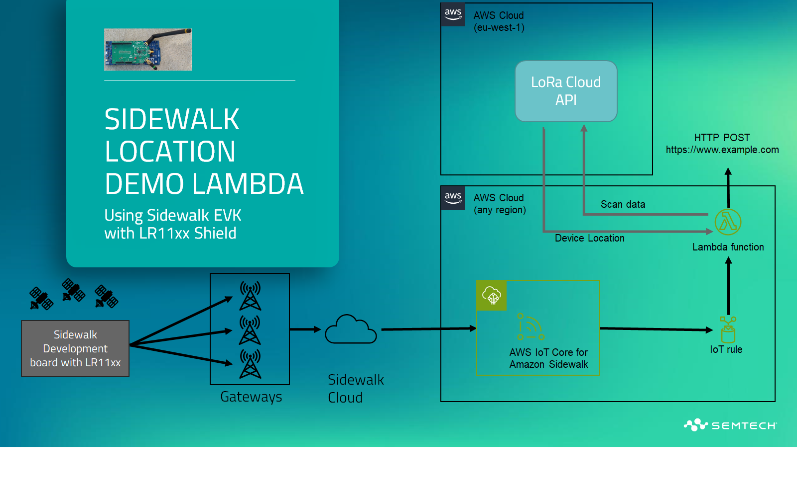
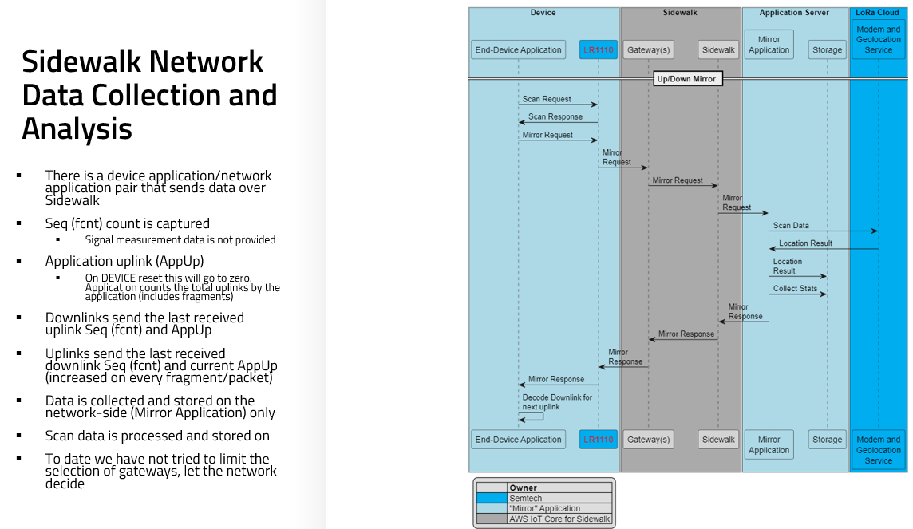
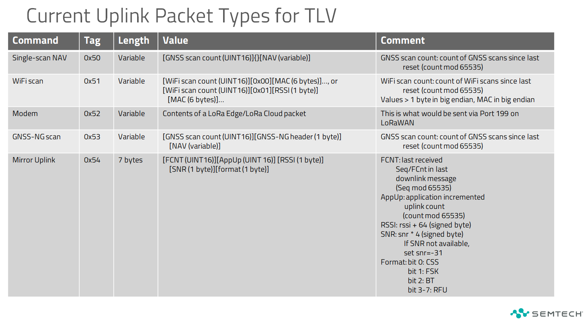

# Example AWS Lamba for Sidewalk Data Processing
---

This is an example using the [Serverless Framework](https://serverless.com), 
Python, AWS Lambda and AWS IoT Core Sidewalk interface between 
the LoRa Edge(TM) development build for Sidewalk and the LoRa Cloud. This code 
first converts the CSS/LoRa fragments into a data payload. These data payloads 
can include WiFi and GNSS scans which can be passed to LoRa Cloud for position 
computation.  While 
this example is developed for AWS Lambda using AWS IoT Core Wireless functions, 
it could be simply adapted to other platforms or environments as required.

---

# Project Architecture
This project is assuming a test program running on an evaluation kit (or similar hardware developed 
for Sidewalk with LoRa Edge) that combines a Sidewalk-compatible EVK/DVK with a LR11x0 shield. 
Data is passed through Sidewalk gateways (Echo or Ring devices) that will be received by
the AWS IoT Core for Amazon Sidewalk network component. The device must be provisioned
on Sidewalk prior to sending data. For more information on provisioning your device on
Sidewalk, please see the corresponding documentation associated with your Sidewalk EVK/DVK.

Once data is in the AWS IoT Core for Amazon Sidewalk it is configured by this application to send 
data to the provided Lambda function as configured by the IoT rule. The Lambda funtion 
(in SidewalkTlvProcess.py) will receive Sidewalk uplinks and defragment the data as necessary. 
Once the original data has been reconstructed through defragmentation, it is passed to the 
LoRa Cloud^TM^ for processing. Once processed, any position solutions returned will be passed to 
a destination URL which could store or further plot or process the location data. 

There are two additional capabilities of this code. First, the data is stored in a "mirror" data table to 
allow for analysis. Also, there are small downlinks sent to the device on complete defragmented data 
to allow for uplink and downlink counting (if enabled on the device).  

# Installation Instructions

## Prerequisites

1. Clone this repo
2. AWS Account with permissions to create Lambda functions and DyanmoDB tables
3. To use the CLI instructions below, install the [sam cli](https://docs.aws.amazon.com/serverless-application-model/latest/developerguide/install-sam-cli.html)

## Installation & Deployment

1. In the main directory of the repo, modify the "Parameter overrides" in samconfig.toml

	> **MgsKey**: the token that is compatible with mgs.loracloud.com, this can be extracted from www.loracloud.com
	
	> **DestinationUri**: the URI for the position output to be sent to (note this does not include the leading "https://" or "http://"
	
	> **DestinationPostApi**: the API resource used to POST the position data to
	
	> **DestinationKey**: the authorization key used to POST the position data on the DestinationUri
 
2. Build the solution with `sam build`
3. Deploy the solutoin with `sam deploy --guided`

# Data Formats
The data is sent in Tag-Length-Value (TLV) format. The first byte of a packet is a "tag" or the 
type of data in the uplink. The next byte of the packet is the length of the value portion of the
packet and the length byte is immediately followed by a data stream which is "length" bytes long.

